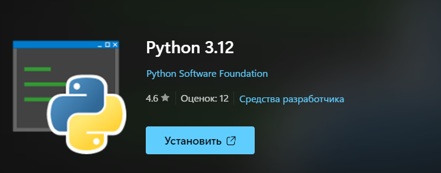
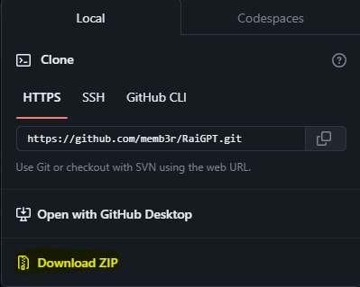

<h1 align="center">
  AI based on GPT 3.5 by OpenAI
</h1>

<p align="center">
  
</p>

<p align="center">
       
</p>

<p align="center">
  <a href="https://github.com/memb3r/RaiGPT/#about">About</a>  ·  <a href="https://github.com/memb3r/RaiGPT/#requirements">Requirements</a>  ·  <a href="https://github.com/memb3r/RaiGPT/#installation">Installation</a>  ·  <a href="https://github.com/memb3r/RaiGPT/#license">License</a>
</p>

## About

RaiGPT is an AI based on GPT 3.5 by OpenAI and  [gpt3free](https://github.com/xtekky/gpt4free) library by xtekky.

RaiGPT is maded by me, memb3r, for people from chat named ["РАЙ"](https://t.me/raichatmishshish) ("RAI").

## Requirements

<code>git</code> (optional):

```bash
sudo apt install git
```

<code>python3</code>:

```bash
sudo apt install python3
```

<code>python3-pip</code>:

```bash
sudo apt install python3-pip
```

## Installation

### Windows:

First, install last <code>python</code> version from Microsoft Store



Then, install ZIP file of a github project and unpack it.



Now move to <code>RaiGPT</code> folder in PowerShell

```bash
cd RaiGPT
# Example
```

Open .py file using <code>python3</code> command

```bash
python3 raigpt.py
```

The project will automaticly install needed libraries, like <code>g4f</code> and <code>rich</code>

### Linux:

Install <code>python3</code>, <code>python3-pip</code> and <code>git</code> using <code>apt</code> or other packaging tools.

```bash
sudo apt install python3 python3-pip git
```

Now, clone the repository:

```bash
git clone https://github.com/memb3r/RaiGPT
```

Move to <code>RaiGPT</code> folder

```bash
cd RaiGPT
# Example
```

Open .py file using <code>python3</code> command

```bash
python3 raigpt.py
```

The project will automaticly install needed libraries, like <code>g4f</code> and <code>rich</code>

## License

This project is licensed under the <code>MIT License</code> - see file [LICENSE](LICENSE) for details.
